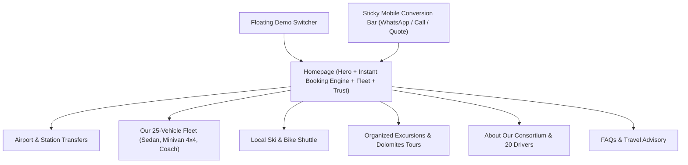

# Taxi Auto Sella — Project Overview & Legacy Website Audit

**Domain**: `https://www.taxiautosella.it/en/`  
**Original Agency**: Digiem (`www.digiem.net`) — Val Gardena, South Tyrol  
**Business Profile**: Val Gardena's largest taxi, minibus, and coach consortium  
**Headquarters**: Str. Gherdeina 7/A, I-39047 Santa Cristina (BZ), Val Gardena, Dolomites, Italy  
**Direct Hotline**: `+39 0471 790033` | **Email**: `info@taxiautosella.it` | **VAT**: `IT01707460216`

---

## 1. Business & Operational Background

Taxi Auto Sella is the primary transportation consortium operating in the Val Gardena valley (Ortisei / St. Ulrich, Santa Cristina, Selva / Wolkenstein) and across the Dolomiti Superski region (Sella Ronda, Alta Badia, Passo Sella, Passo Gardena).

### Core Assets & Capabilities
* **Fleet Capacity**: 25 modern vehicles, primarily Mercedes-Benz 4MATIC (4-wheel drive essential for Alpine winter conditions).
  * Luxury Sedans (1–3 passengers)
  * Mercedes Vito / V-Class 4Matic Minibuses (up to 8 passengers + full ski boxes)
  * VIP Minicoaches (16 to 30 passengers)
  * Grand Touring Coaches (up to 56 passengers)
  * Wheelchair / Reduced Mobility Accessible Vehicles
* **Consortium Structure**: 18–20 independent local drivers working under a unified dispatch office.
* **Services**:
  * **Airport Transfers**: Innsbruck (INN), Munich (MUC), Verona (VRN), Venice Marco Polo (VCE), Bergamo Orio al Serio (BGY), Milan Malpensa (MXP), Milan Linate (LIN), Treviso (TSF), Bologna (BLQ), Bolzano (BZO).
  * **Train Station Shuttles**: Bolzano, Bressanone (Brixen), Chiusa (Klausen), Ponte Gardena.
  * **Local Ski & Night Shuttle**: 24/7 high-season on-call service connecting hotels to ski lifts (Ciampinoi, Seceda, Dantercepies, Saslong, Alpe di Siusi) and après-ski venues.
  * **Bike & Luggage Shuttle**: Trans-Dolomite luggage transport and mountain bike trailers for summer tourists.
  * **Organized Excursions**: Sella Ronda panoramic tours, Venice Lagoon, Verona Opera, Innsbruck Imperial Tour, Merano Thermal Gardens.

---

## 2. Legacy Website Audit (Digiem Implementation)

The current website was designed and built by local agency *Digiem* using an early 2010s desktop-centric architecture:

### Technical Stack (Legacy)
* **Markup & Structure**: Static HTML with PHP backend includes, Swiper.js v3.x slider, Modernizr 3.11, Klaro cookie consent banner.
* **Layout**: Fixed left-sidebar layout (`width: ~270px`) with a right content pane. On desktop, this squashes the main content area; on mobile, it collapses awkwardly into a hidden hamburger menu.
* **Typography**: Google Noto Sans 400/700 without modern typographic hierarchy or contrast.
* **Languages**: English (`/en/`), German (`/de/`), Italian (`/it/`), Russian (`/ru/`).

### UX & Conversion Bottlenecks Identified

| Critical Issue | Legacy Site Behavior | Modern Standard Required |
| :--- | :--- | :--- |
| **No Instant Price Calculator** | User must fill a generic text form and wait hours/days for an email reply. | Dynamic interactive widget giving instant price and time estimates based on route and vehicle. |
| **Weak Mobile Experience** | Sidebar collapses into a slow menu; booking form requires tedious manual typing on phone. | Mobile-first layout with sticky 1-tap WhatsApp and Phone CTA buttons. |
| **Zero Flight Tracking Visibility** | No mention of automatic flight tracking for airport delays. | Prominent "Free Flight Delay Tracking & Meet & Greet" guarantee. |
| **Missing Social Proof** | Zero reviews, ratings, or customer testimonials shown on the site. | Live TripAdvisor / Google Reviews rating badges (e.g. 4.9/5 stars) and client quotes. |
| **Understated Fleet Presentation** | Small thumbnail gallery without clear capacity badges (passengers, luggage, ski equipment). | Interactive vehicle carousel with animated passenger, luggage, and ski equipment indicators. |
| **Buried Local Emergency Taxi** | Local tourists stuck at a ski lift or restaurant have to dig through paragraphs to find the phone number. | Dedicated "Local 24/7 Taxi Dispatch" quick action. |

---

## 3. Recommended Modern Information Architecture

---

## 4. Key Takeaways for the Redesign
1. **Highlight the 25-Vehicle 4x4 Consortium Strength**: Unlike lone taxi drivers or anonymous Uber apps, Taxi Auto Sella has the fleet scale and local mountain expertise to guarantee on-time pickup in heavy snowstorms.
2. **Implement Dual-Track Booking**:
   - **Track 1**: Instant long-distance airport transfer quote & booking engine.
   - **Track 2**: Instant 1-tap WhatsApp/Phone dispatch for local rides in Ortisei, Santa Cristina, and Selva.
3. **Offer 3 Switchable Creative Concepts**: Let the owners visually compare **Alpine Luxury**, **Modern Tech (WelcomePickups style)**, and **Dolomites Adventure** before making a final decision.
