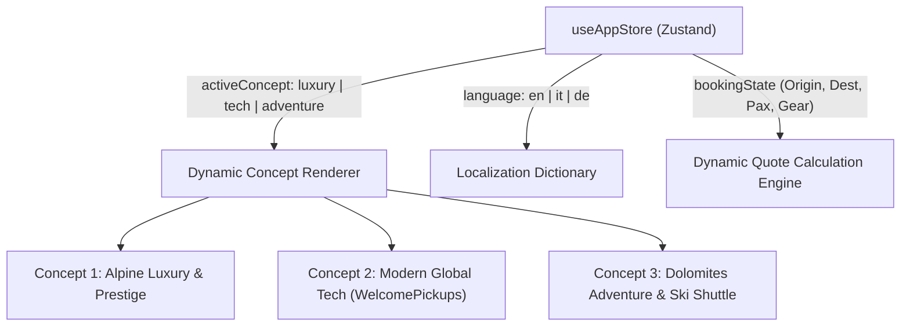

# Technical Architecture & Engineering Decisions

Evaluation of the tech stack, global state orchestration, multilingual localization, and universal static distribution.

---

## 1. Framework Evaluation & Final Selection

| Criteria | Vite + React + TS (Chosen) | Astro | Next.js |
| :--- | :--- | :--- | :--- |
| **Interactive Demo Switcher** | **Instantaneous 0ms state swap** without page reload or flickering. | Requires Nano Stores; cross-island state can cause layout jumps. | Heavy edge runtime overhead; potential cold starts on free tiers. |
| **Build Speed** | **< 3 seconds** bundle time. | ~5–10 seconds. | ~15–30 seconds. |
| **Cloudflare Pages Compatibility** | **100% native static asset serving** via Cloudflare Global CDN. | Supported (static adapter). | Requires `@cloudflare/next-on-pages` edge worker shims. |
| **Universal Portability** | **Pure static HTML/CSS/JS** output (`dist/`). Can be moved to Apache, Nginx, Vercel, Netlify, cPanel anytime. | High portability. | Low portability (Node/Vercel vendor tie-ins). |

**Decision**: **Vite + React 18 + TypeScript + Tailwind CSS** provides the ideal balance between instantaneous interactive client-side demo switcher, rich interactive booking calculator, zero cold-starts, and 100% universal hosting portability.

---

## 2. Design System & Theming Architecture

The 3 design concepts are managed through a unified state machine in Zustand (`src/store/useAppStore.ts`). 

### Theming Strategy:
- **Concept 1 (Alpine Luxury & Prestige)**:
  - Font: *Playfair Display* / *Cormorant Garamond* + *Inter*
  - Color Theme: `#0B0F17` (Deep Obsidian), `#D4AF37` (Champagne Gold), `#1E293B` (Slate)
  - Styling: High-end luxury typography, glassmorphism, subtle gold border accents, refined shadows.
- **Concept 2 (Modern Global Tech — WelcomePickups Inspired)**:
  - Font: *Plus Jakarta Sans* / *Inter*
  - Color Theme: `#FFFFFF` (Pure Snow), `#059669` (Emerald Green), `#0F172A` (Navy Slate), `#F59E0B` (Amber)
  - Styling: High-contrast card interfaces, clean shadows, prominent hero booking widget, rating badges.
- **Concept 3 (Dolomites Adventure & Ski Shuttle)**:
  - Font: *Outfit* / *Montserrat*
  - Color Theme: `#0C2340` (Alpine Navy), `#0284C7` (Glacier Ice Blue), `#10B981` (Mountain Emerald), `#EA580C` (Sunset Orange)
  - Styling: Dynamic full-bleed mountain imagery, gear badges, bold outdoor typography, ski map cards.

---

## 3. Dynamic Quote Calculation Logic

The pricing engine (`src/data/routes.ts`) calculates route costs using standard South Tyrol NCC (*Noleggio con Conducente*) rate models:

$$\text{Price} = \text{Base Price} \times \text{Vehicle Multiplier} + \text{Add-ons}$$

### Vehicle Multipliers:
- **Mercedes E-Class 4Matic (1–3 Pax)**: $1.0\times$ (Standard baseline)
- **Mercedes V-Class Luxury (1–7 Pax)**: $1.25\times$ (Executive leather interior, conference seating)
- **Mercedes Vito 4Matic Minibus (1–8 Pax + Ski Box)**: $1.20\times$ (Max group utility)
- **Mercedes Sprinter VIP Coach (1–16 Pax)**: $1.85\times$ (Small groups, ski teams)
- **Grand Luxury Coach (up to 56 Pax)**: $3.20\times$ (Tour groups, corporate retreats)

All transfers include:
- Free Meet & Greet with name board
- Automatic flight delay monitoring
- Motorway tolls and Alpine pass permits included
- Winter-equipped 4x4 vehicles with winter tires and snow chains
